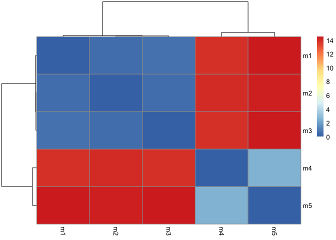
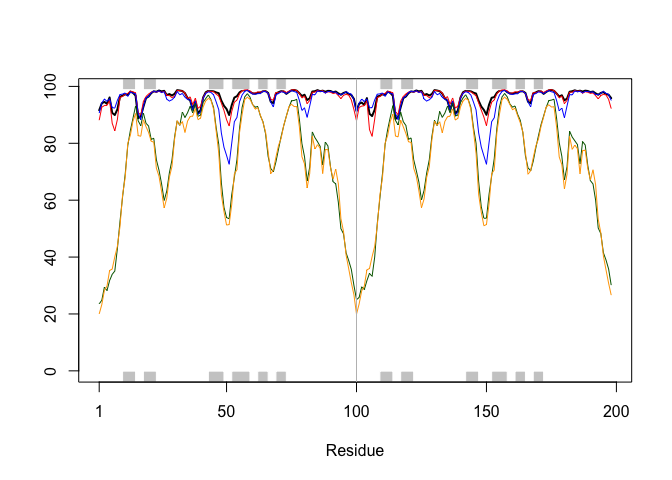
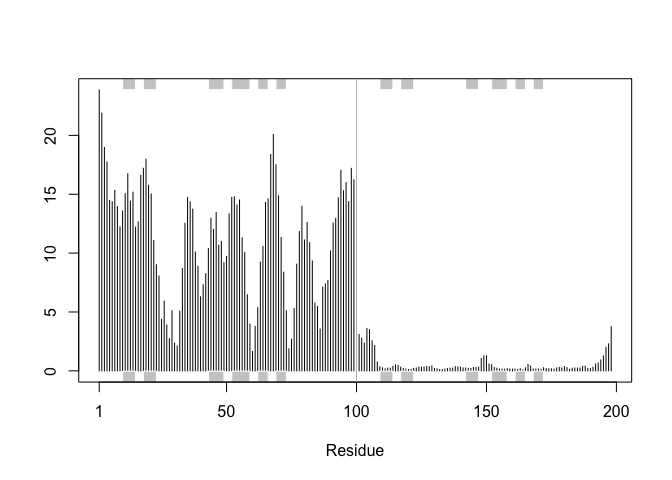

# Class_11
Brad Hunter (PID: A69038089)

## Background

We saw last class that the PDB has 209,886 entries (Oct/Nov 2025).
UniprotKB (i.e. protein sequence database) has 199,579,901 entries.

So the PDB has only 0.11% coverage of the main sequence database.

Enter AlphaFold data base (AFDB) \< http://alphafold.ebi.ac.uk \> that
attempts to provide computed models for all sequences in UniProt.

“AlphaFold DB provides open access to over 200 million protein structure
predictions to accelerate scientific research.”

## AlphaFold

AlphaFold has 3 main outputs

- The predicted coordinates (PDB file)
- A local quality score called pLDDT (one for each amino-acid)
- A second quality score called PAE, Predicted Aligned Error (for each
  pair of amino-acid)

We can run AlphaFold ourselves if we are not happy with AFDB (i.e. no
coverage or poor model).

## Interpreting/analyzing AF results in R

``` r
results_dir <- "Brads_HIVPR_dimer_23119/"
```

``` r
# File names for all PDB models
pdb_files <- list.files(path=results_dir,
                        pattern="*.pdb",
                        full.names = TRUE)

# Print our PDB file names
basename(pdb_files)
```

    [1] "Brads_HIVPR_dimer_23119_unrelaxed_rank_001_alphafold2_multimer_v3_model_4_seed_000.pdb"
    [2] "Brads_HIVPR_dimer_23119_unrelaxed_rank_002_alphafold2_multimer_v3_model_1_seed_000.pdb"
    [3] "Brads_HIVPR_dimer_23119_unrelaxed_rank_003_alphafold2_multimer_v3_model_5_seed_000.pdb"
    [4] "Brads_HIVPR_dimer_23119_unrelaxed_rank_004_alphafold2_multimer_v3_model_2_seed_000.pdb"
    [5] "Brads_HIVPR_dimer_23119_unrelaxed_rank_005_alphafold2_multimer_v3_model_3_seed_000.pdb"

``` r
library(bio3d)
library(bio3dview)
# Read all data from Models 
#  and superpose/fit coords
pdbs <- pdbaln(pdb_files, fit=TRUE, exefile="msa")
```

    Reading PDB files:
    Brads_HIVPR_dimer_23119//Brads_HIVPR_dimer_23119_unrelaxed_rank_001_alphafold2_multimer_v3_model_4_seed_000.pdb
    Brads_HIVPR_dimer_23119//Brads_HIVPR_dimer_23119_unrelaxed_rank_002_alphafold2_multimer_v3_model_1_seed_000.pdb
    Brads_HIVPR_dimer_23119//Brads_HIVPR_dimer_23119_unrelaxed_rank_003_alphafold2_multimer_v3_model_5_seed_000.pdb
    Brads_HIVPR_dimer_23119//Brads_HIVPR_dimer_23119_unrelaxed_rank_004_alphafold2_multimer_v3_model_2_seed_000.pdb
    Brads_HIVPR_dimer_23119//Brads_HIVPR_dimer_23119_unrelaxed_rank_005_alphafold2_multimer_v3_model_3_seed_000.pdb
    .....

    Extracting sequences

    pdb/seq: 1   name: Brads_HIVPR_dimer_23119//Brads_HIVPR_dimer_23119_unrelaxed_rank_001_alphafold2_multimer_v3_model_4_seed_000.pdb 
    pdb/seq: 2   name: Brads_HIVPR_dimer_23119//Brads_HIVPR_dimer_23119_unrelaxed_rank_002_alphafold2_multimer_v3_model_1_seed_000.pdb 
    pdb/seq: 3   name: Brads_HIVPR_dimer_23119//Brads_HIVPR_dimer_23119_unrelaxed_rank_003_alphafold2_multimer_v3_model_5_seed_000.pdb 
    pdb/seq: 4   name: Brads_HIVPR_dimer_23119//Brads_HIVPR_dimer_23119_unrelaxed_rank_004_alphafold2_multimer_v3_model_2_seed_000.pdb 
    pdb/seq: 5   name: Brads_HIVPR_dimer_23119//Brads_HIVPR_dimer_23119_unrelaxed_rank_005_alphafold2_multimer_v3_model_3_seed_000.pdb 

``` r
pdbs
```

                                   1        .         .         .         .         50 
    [Truncated_Name:1]Brads_HIVP   PQITLWQRPLVTIKIGGQLKEALLDTGADDTVLEEMSLPGRWKPKMIGGI
    [Truncated_Name:2]Brads_HIVP   PQITLWQRPLVTIKIGGQLKEALLDTGADDTVLEEMSLPGRWKPKMIGGI
    [Truncated_Name:3]Brads_HIVP   PQITLWQRPLVTIKIGGQLKEALLDTGADDTVLEEMSLPGRWKPKMIGGI
    [Truncated_Name:4]Brads_HIVP   PQITLWQRPLVTIKIGGQLKEALLDTGADDTVLEEMSLPGRWKPKMIGGI
    [Truncated_Name:5]Brads_HIVP   PQITLWQRPLVTIKIGGQLKEALLDTGADDTVLEEMSLPGRWKPKMIGGI
                                   ************************************************** 
                                   1        .         .         .         .         50 

                                  51        .         .         .         .         100 
    [Truncated_Name:1]Brads_HIVP   GGFIKVRQYDQILIEICGHKAIGTVLVGPTPVNIIGRNLLTQIGCTLNFP
    [Truncated_Name:2]Brads_HIVP   GGFIKVRQYDQILIEICGHKAIGTVLVGPTPVNIIGRNLLTQIGCTLNFP
    [Truncated_Name:3]Brads_HIVP   GGFIKVRQYDQILIEICGHKAIGTVLVGPTPVNIIGRNLLTQIGCTLNFP
    [Truncated_Name:4]Brads_HIVP   GGFIKVRQYDQILIEICGHKAIGTVLVGPTPVNIIGRNLLTQIGCTLNFP
    [Truncated_Name:5]Brads_HIVP   GGFIKVRQYDQILIEICGHKAIGTVLVGPTPVNIIGRNLLTQIGCTLNFP
                                   ************************************************** 
                                  51        .         .         .         .         100 

                                 101        .         .         .         .         150 
    [Truncated_Name:1]Brads_HIVP   QITLWQRPLVTIKIGGQLKEALLDTGADDTVLEEMSLPGRWKPKMIGGIG
    [Truncated_Name:2]Brads_HIVP   QITLWQRPLVTIKIGGQLKEALLDTGADDTVLEEMSLPGRWKPKMIGGIG
    [Truncated_Name:3]Brads_HIVP   QITLWQRPLVTIKIGGQLKEALLDTGADDTVLEEMSLPGRWKPKMIGGIG
    [Truncated_Name:4]Brads_HIVP   QITLWQRPLVTIKIGGQLKEALLDTGADDTVLEEMSLPGRWKPKMIGGIG
    [Truncated_Name:5]Brads_HIVP   QITLWQRPLVTIKIGGQLKEALLDTGADDTVLEEMSLPGRWKPKMIGGIG
                                   ************************************************** 
                                 101        .         .         .         .         150 

                                 151        .         .         .         .       198 
    [Truncated_Name:1]Brads_HIVP   GFIKVRQYDQILIEICGHKAIGTVLVGPTPVNIIGRNLLTQIGCTLNF
    [Truncated_Name:2]Brads_HIVP   GFIKVRQYDQILIEICGHKAIGTVLVGPTPVNIIGRNLLTQIGCTLNF
    [Truncated_Name:3]Brads_HIVP   GFIKVRQYDQILIEICGHKAIGTVLVGPTPVNIIGRNLLTQIGCTLNF
    [Truncated_Name:4]Brads_HIVP   GFIKVRQYDQILIEICGHKAIGTVLVGPTPVNIIGRNLLTQIGCTLNF
    [Truncated_Name:5]Brads_HIVP   GFIKVRQYDQILIEICGHKAIGTVLVGPTPVNIIGRNLLTQIGCTLNF
                                   ************************************************ 
                                 151        .         .         .         .       198 

    Call:
      pdbaln(files = pdb_files, fit = TRUE, exefile = "msa")

    Class:
      pdbs, fasta

    Alignment dimensions:
      5 sequence rows; 198 position columns (198 non-gap, 0 gap) 

    + attr: xyz, resno, b, chain, id, ali, resid, sse, call

RMSD is a standard measure of structural distance between coordinate
sets. We can use the `rmsd()` function to calculate the RMSD between all
pairs models.

``` r
rd <- rmsd(pdbs, fit=T)
```

    Warning in rmsd(pdbs, fit = T): No indices provided, using the 198 non NA positions

``` r
range(rd)
```

    [1]  0.000 14.526

Drawing a heatmat

``` r
library(pheatmap)

colnames(rd) <- paste0("m",1:5)
rownames(rd) <- paste0("m",1:5)
pheatmap(rd)
```



Now lets plot the pLDDT values across all models.

``` r
pdb <- read.pdb("1hsg")
```

      Note: Accessing on-line PDB file

``` r
plotb3(pdbs$b[1,], typ="l", lwd=2, sse=pdb)
points(pdbs$b[2,], typ="l", col="red")
points(pdbs$b[3,], typ="l", col="blue")
points(pdbs$b[4,], typ="l", col="darkgreen")
points(pdbs$b[5,], typ="l", col="orange")
abline(v=100, col="gray")
```



``` r
core <- core.find(pdbs)
```

     core size 197 of 198  vol = 5437.294 
     core size 196 of 198  vol = 4705.336 
     core size 195 of 198  vol = 1827.704 
     core size 194 of 198  vol = 1121.539 
     core size 193 of 198  vol = 1047.76 
     core size 192 of 198  vol = 999.32 
     core size 191 of 198  vol = 953.718 
     core size 190 of 198  vol = 910.755 
     core size 189 of 198  vol = 870.203 
     core size 188 of 198  vol = 836.304 
     core size 187 of 198  vol = 805.237 
     core size 186 of 198  vol = 775.99 
     core size 185 of 198  vol = 752.564 
     core size 184 of 198  vol = 712.023 
     core size 183 of 198  vol = 685.568 
     core size 182 of 198  vol = 663.911 
     core size 181 of 198  vol = 645.881 
     core size 180 of 198  vol = 627.97 
     core size 179 of 198  vol = 611.812 
     core size 178 of 198  vol = 595.931 
     core size 177 of 198  vol = 581.132 
     core size 176 of 198  vol = 566.736 
     core size 175 of 198  vol = 548.587 
     core size 174 of 198  vol = 534.114 
     core size 173 of 198  vol = 505.214 
     core size 172 of 198  vol = 491.225 
     core size 171 of 198  vol = 473.905 
     core size 170 of 198  vol = 460.426 
     core size 169 of 198  vol = 444.81 
     core size 168 of 198  vol = 431.661 
     core size 167 of 198  vol = 421.542 
     core size 166 of 198  vol = 405.601 
     core size 165 of 198  vol = 392.666 
     core size 164 of 198  vol = 381.077 
     core size 163 of 198  vol = 367.559 
     core size 162 of 198  vol = 358.379 
     core size 161 of 198  vol = 346.865 
     core size 160 of 198  vol = 334.809 
     core size 159 of 198  vol = 324.09 
     core size 158 of 198  vol = 312.153 
     core size 157 of 198  vol = 301.296 
     core size 156 of 198  vol = 290.431 
     core size 155 of 198  vol = 281.319 
     core size 154 of 198  vol = 272.529 
     core size 153 of 198  vol = 263.215 
     core size 152 of 198  vol = 253.54 
     core size 151 of 198  vol = 240.86 
     core size 150 of 198  vol = 227.447 
     core size 149 of 198  vol = 215.581 
     core size 148 of 198  vol = 202.041 
     core size 147 of 198  vol = 195.426 
     core size 146 of 198  vol = 188.721 
     core size 145 of 198  vol = 181.778 
     core size 144 of 198  vol = 173.615 
     core size 143 of 198  vol = 165.946 
     core size 142 of 198  vol = 156.117 
     core size 141 of 198  vol = 149.814 
     core size 140 of 198  vol = 143.616 
     core size 139 of 198  vol = 135.81 
     core size 138 of 198  vol = 127.851 
     core size 137 of 198  vol = 122.596 
     core size 136 of 198  vol = 117.203 
     core size 135 of 198  vol = 109.848 
     core size 134 of 198  vol = 104.812 
     core size 133 of 198  vol = 98.776 
     core size 132 of 198  vol = 94.799 
     core size 131 of 198  vol = 90.494 
     core size 130 of 198  vol = 87.403 
     core size 129 of 198  vol = 83.558 
     core size 128 of 198  vol = 79.08 
     core size 127 of 198  vol = 75.056 
     core size 126 of 198  vol = 71.238 
     core size 125 of 198  vol = 67.735 
     core size 124 of 198  vol = 64.289 
     core size 123 of 198  vol = 61.381 
     core size 122 of 198  vol = 57.515 
     core size 121 of 198  vol = 53.254 
     core size 120 of 198  vol = 48.654 
     core size 119 of 198  vol = 45.832 
     core size 118 of 198  vol = 41.819 
     core size 117 of 198  vol = 38.71 
     core size 116 of 198  vol = 36.294 
     core size 115 of 198  vol = 33.386 
     core size 114 of 198  vol = 30.472 
     core size 113 of 198  vol = 27.786 
     core size 112 of 198  vol = 25.403 
     core size 111 of 198  vol = 22.827 
     core size 110 of 198  vol = 21.106 
     core size 109 of 198  vol = 19.327 
     core size 108 of 198  vol = 17.796 
     core size 107 of 198  vol = 16.235 
     core size 106 of 198  vol = 14.508 
     core size 105 of 198  vol = 12.969 
     core size 104 of 198  vol = 11.834 
     core size 103 of 198  vol = 11.185 
     core size 102 of 198  vol = 10.298 
     core size 101 of 198  vol = 8.898 
     core size 100 of 198  vol = 7.813 
     core size 99 of 198  vol = 6.074 
     core size 98 of 198  vol = 5.286 
     core size 97 of 198  vol = 4.43 
     core size 96 of 198  vol = 3.873 
     core size 95 of 198  vol = 3.321 
     core size 94 of 198  vol = 2.855 
     core size 93 of 198  vol = 2.293 
     core size 92 of 198  vol = 1.937 
     core size 91 of 198  vol = 1.631 
     core size 90 of 198  vol = 1.331 
     core size 89 of 198  vol = 0.957 
     core size 88 of 198  vol = 0.803 
     core size 87 of 198  vol = 0.647 
     core size 86 of 198  vol = 0.532 
     core size 85 of 198  vol = 0.444 
     FINISHED: Min vol ( 0.5 ) reached

``` r
core.inds <- print(core, vol=0.5)
```

    # 86 positions (cumulative volume <= 0.5 Angstrom^3) 
      start end length
    1     7   7      1
    2     9  49     41
    3    52  95     44

``` r
xyz <- pdbfit(pdbs, core.inds, outpath="corefit_structures")

rf <- rmsf(xyz)

plotb3(rf, sse=pdb)
abline(v=100, col="gray", ylab="RMSF")
```


