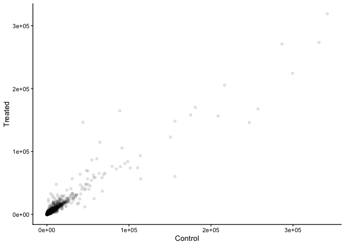
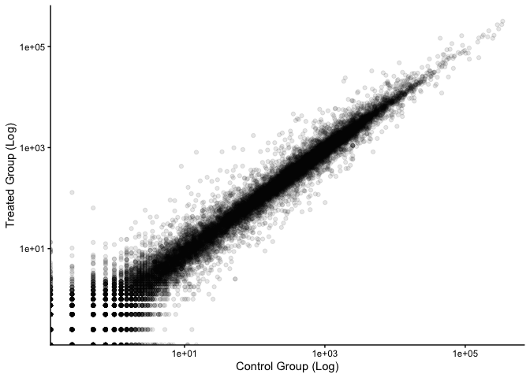
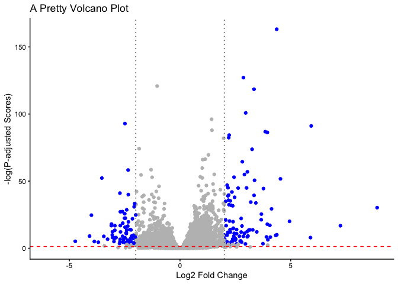

# Class_13_RNASeq
Brad Hunter (PID: A69038089)

- [Background](#background)
- [Data Import](#data-import)
- [Filter out zeros](#filter-out-zeros)
- [DESeq analysis](#deseq-analysis)
- [Valcano Plot](#valcano-plot)
- [A nicer ggplot volcano plot](#a-nicer-ggplot-volcano-plot)
- [Adding annotation data](#adding-annotation-data)
- [Save our results](#save-our-results)
- [Pathway Analysis](#pathway-analysis)

## Background

Today we will analyze some RNASeq data from Himes et al. on the effects
of a common steroid (dexmethasone also called “dex”) on airway smooth
muscle cells (ASMs).

For this analysis we need two main inputs

- `countData`: a table of **counts** per gene (in rows) accross
  experiments (in columns)
- `colData`: a table of **metadata** about the design of the
  experiments. The rows match the columns in `countData`

## Data Import

``` r
counts <- read.csv("airway_scaledcounts.csv", row.names = 1)
metadata <- read.csv("airway_metadata.csv")
```

Let’s have a peek at the counts dataframe:

``` r
head(counts)
```

                    SRR1039508 SRR1039509 SRR1039512 SRR1039513 SRR1039516
    ENSG00000000003        723        486        904        445       1170
    ENSG00000000005          0          0          0          0          0
    ENSG00000000419        467        523        616        371        582
    ENSG00000000457        347        258        364        237        318
    ENSG00000000460         96         81         73         66        118
    ENSG00000000938          0          0          1          0          2
                    SRR1039517 SRR1039520 SRR1039521
    ENSG00000000003       1097        806        604
    ENSG00000000005          0          0          0
    ENSG00000000419        781        417        509
    ENSG00000000457        447        330        324
    ENSG00000000460         94        102         74
    ENSG00000000938          0          0          0

and the `metadata`

``` r
head(metadata)
```

              id     dex celltype     geo_id
    1 SRR1039508 control   N61311 GSM1275862
    2 SRR1039509 treated   N61311 GSM1275863
    3 SRR1039512 control  N052611 GSM1275866
    4 SRR1039513 treated  N052611 GSM1275867
    5 SRR1039516 control  N080611 GSM1275870
    6 SRR1039517 treated  N080611 GSM1275871

> Q1. How many “genes” are in the dataset?

38694

> Q2. How many experiments (i.e. columns in `counts` or rows in
> `metadata`) are there?

8

> Q3. How many “control” experiments are there in the dataset?

4

> Q3. How would you make the above code in either approach more robust?
> Is there a function that could help here?

instead of `control.mean <- rowSums( control.counts )/4` use
`control.mean <- rowMeans(control.counts)`

Plan of Attack: 1. Extract the “control” columns from `counts` 2.
Calculate the mean value for each gene in these “control” columns. 3-4.
Do the same for the “treated” columns 5. Compare these mean values for
each gene

Let’s do that!

Step 1.

``` r
control.counts <- counts[, metadata$dex == "control"]
```

Step 2.

``` r
control.mean <- rowMeans(control.counts)
```

Steps 3-4. \> Q4. Follow the same procedure for the treated samples
(i.e. calculate the mean per gene across drug treated samples and assign
to a labeled vector called treated.mean)

``` r
treated.counts <- counts[, metadata$dex == "treated"]
treated.mean <- rowMeans(treated.counts)
```

For ease of book-keeping, we can store these together in one data frame
called `meancounts`

``` r
meancounts <- data.frame(control.mean, treated.mean)
```

> Q5 (a). Create a scatter plot showing the mean of the treated samples
> against the mean of the control samples. Your plot should look
> something like the following.

``` r
plot(meancounts[,1],meancounts[,2], xlab="Control", ylab="Treated")
```


> Q5 (b).You could also use the ggplot2 package to make this figure
> producing the plot below. What geom\_?() function would you use for
> this plot?

geom_point()

``` r
library(ggplot2)
```

    Warning: package 'ggplot2' was built under R version 4.5.2

``` r
ggplot(meancounts) +
  aes(control.mean, treated.mean) +
  geom_point(alpha=0.1) +
  labs(x="Control", y="Treated") +
  theme_classic()
```



> Q6. Try plotting both axes on a log scale. What is the argument to
> plot() that allows you to do this?

log = “xy”

Let’s plot them

``` r
library(ggplot2)
ggplot(meancounts) +
  aes(control.mean, treated.mean) +
  geom_point(alpha=0.1) +
  scale_x_log10() +
  scale_y_log10() +
  labs(x="Control Group (Log)", y="Treated Group (Log)") +
  theme_classic()
```

    Warning in scale_x_log10(): log-10 transformation introduced infinite values.

    Warning in scale_y_log10(): log-10 transformation introduced infinite values.



We use “fold-change” as a way to compare big differences

``` r
meancounts$log2fc = log2(meancounts$treated.mean/meancounts$control.mean)
```

A common “rule-of-thumb” threshold for calling something “upregulated”
is a log2-fold-change of +2 or greater. And for “downregulated” -2 or
less.

## Filter out zeros

``` r
non.zero.inds <-rowSums(counts) != 0
mycounts <- meancounts[non.zero.inds,]
```

``` r
zero.inds <- which(meancounts[,1:2] == 0, arr.ind = T)[,1]
mygenes <- meancounts[-zero.inds,]
```

> Q8. How many genes are “up” regulated an the +2 log2FC threshold?

``` r
sum(mygenes$log2fc > 2)
```

    [1] 250

> Q9. How many genes are “down” regulated at the -2 log2FC threshold?

``` r
sum(mygenes$log2fc < -2)
```

    [1] 367

> Q10. Q10. Do you trust these results? Why or why not?

No, because there are no statistics to support the results.

This is cute, but not statistically sound.

## DESeq analysis

Let’s do this with DESeq2 and put some stats behinds these numbers.

``` r
library(DESeq2)
```

DESeq wants three things for analysis: countData, colData and design.

``` r
dds <- DESeqDataSetFromMatrix(countData = counts,
                       colData = metadata,
                       design = ~dex)
```

    converting counts to integer mode

    Warning in DESeqDataSet(se, design = design, ignoreRank): some variables in
    design formula are characters, converting to factors

The main function in the DESeq package to run analysis is called
`DESeq()`.

``` r
dds <- DESeq(dds)
```

    estimating size factors

    estimating dispersions

    gene-wise dispersion estimates

    mean-dispersion relationship

    final dispersion estimates

    fitting model and testing

Get the results out of this DESeq object with the function `results()`.

``` r
res <- results(dds)
head(res)
```

    log2 fold change (MLE): dex treated vs control 
    Wald test p-value: dex treated vs control 
    DataFrame with 6 rows and 6 columns
                      baseMean log2FoldChange     lfcSE      stat    pvalue
                     <numeric>      <numeric> <numeric> <numeric> <numeric>
    ENSG00000000003 747.194195      -0.350703  0.168242 -2.084514 0.0371134
    ENSG00000000005   0.000000             NA        NA        NA        NA
    ENSG00000000419 520.134160       0.206107  0.101042  2.039828 0.0413675
    ENSG00000000457 322.664844       0.024527  0.145134  0.168996 0.8658000
    ENSG00000000460  87.682625      -0.147143  0.256995 -0.572550 0.5669497
    ENSG00000000938   0.319167      -1.732289  3.493601 -0.495846 0.6200029
                         padj
                    <numeric>
    ENSG00000000003  0.163017
    ENSG00000000005        NA
    ENSG00000000419  0.175937
    ENSG00000000457  0.961682
    ENSG00000000460  0.815805
    ENSG00000000938        NA

## Valcano Plot

This is a plot of log2FC vs adjusted p-value

``` r
plot(res$log2FoldChange, -log(res$padj))
abline(v=c(-2,2), col = "red")
abline(h=-log(0.05), col = "red")
```


## A nicer ggplot volcano plot

Let’s make a prettier volcano plot using ggplot

``` r
mycols <- rep("grey", nrow(res))
mycols[abs(res$log2FoldChange) > 2] <- "blue"
mycols[res$padj >= 0.05] <- "grey"

ggplot(res) +
  aes(log2FoldChange,-log(padj)) +
  geom_point(col=mycols) +
  geom_vline(xintercept = c(-2, 2), linetype = "dotted", color = "grey40", linewidth = 0.6) +
  geom_hline(yintercept = -log10(0.05), linetype = "dashed", color = "red") +
  labs(x = "Log2 Fold Change",
       y = "-log(P-adjusted Scores)",
       title = "A Pretty Volcano Plot") +
  theme_classic()
```

    Warning: Removed 23549 rows containing missing values or values outside the scale range
    (`geom_point()`).



## Adding annotation data

We need to add gene symbols, gene names and other database IDs to make
my results useful for further analysis.

We have ENSEMBLE database IDs in our `res` object

``` r
head(rownames(res))
```

    [1] "ENSG00000000003" "ENSG00000000005" "ENSG00000000419" "ENSG00000000457"
    [5] "ENSG00000000460" "ENSG00000000938"

We can use the `mapIDs()` function from bioconductor to help us.

``` r
library("AnnotationDbi")
library("org.Hs.eg.db")
```

Let’s see what database ID formats we can translate between

``` r
columns(org.Hs.eg.db)
```

     [1] "ACCNUM"       "ALIAS"        "ENSEMBL"      "ENSEMBLPROT"  "ENSEMBLTRANS"
     [6] "ENTREZID"     "ENZYME"       "EVIDENCE"     "EVIDENCEALL"  "GENENAME"    
    [11] "GENETYPE"     "GO"           "GOALL"        "IPI"          "MAP"         
    [16] "OMIM"         "ONTOLOGY"     "ONTOLOGYALL"  "PATH"         "PFAM"        
    [21] "PMID"         "PROSITE"      "REFSEQ"       "SYMBOL"       "UCSCKG"      
    [26] "UNIPROT"     

``` r
res$symbol <- mapIds(org.Hs.eg.db,
                     keys=row.names(res), # Our genenames
                     keytype="ENSEMBL",   # The format of our genenames
                     column="SYMBOL",     # The new format we want to add
                     multiVals="first")
```

    'select()' returned 1:many mapping between keys and columns

Add `GENENAME` then `ENTREZID`

``` r
res$genename <- mapIds(org.Hs.eg.db,
                     keys=row.names(res), # Our genenames
                     keytype="ENSEMBL",   # The format of our genenames
                     column="GENENAME",     # The new format we want to add
                     multiVals="first")
```

    'select()' returned 1:many mapping between keys and columns

``` r
res$entrez <- mapIds(org.Hs.eg.db,
                     keys=row.names(res), # Our genenames
                     keytype="ENSEMBL",   # The format of our genenames
                     column="ENTREZID",     # The new format we want to add
                     multiVals="first")
```

    'select()' returned 1:many mapping between keys and columns

## Save our results

``` r
write.csv(res, file="myresults_annotated.csv")
```

## Pathway Analysis

``` r
library(pathview)
```

    ##############################################################################
    Pathview is an open source software package distributed under GNU General
    Public License version 3 (GPLv3). Details of GPLv3 is available at
    http://www.gnu.org/licenses/gpl-3.0.html. Particullary, users are required to
    formally cite the original Pathview paper (not just mention it) in publications
    or products. For details, do citation("pathview") within R.

    The pathview downloads and uses KEGG data. Non-academic uses may require a KEGG
    license agreement (details at http://www.kegg.jp/kegg/legal.html).
    ##############################################################################

``` r
library(gage)
```

``` r
library(gageData)

data(kegg.sets.hs)

# Examine the first 2 pathways in this kegg set for humans
head(kegg.sets.hs, 2)
```

    $`hsa00232 Caffeine metabolism`
    [1] "10"   "1544" "1548" "1549" "1553" "7498" "9"   

    $`hsa00983 Drug metabolism - other enzymes`
     [1] "10"     "1066"   "10720"  "10941"  "151531" "1548"   "1549"   "1551"  
     [9] "1553"   "1576"   "1577"   "1806"   "1807"   "1890"   "221223" "2990"  
    [17] "3251"   "3614"   "3615"   "3704"   "51733"  "54490"  "54575"  "54576" 
    [25] "54577"  "54578"  "54579"  "54600"  "54657"  "54658"  "54659"  "54963" 
    [33] "574537" "64816"  "7083"   "7084"   "7172"   "7363"   "7364"   "7365"  
    [41] "7366"   "7367"   "7371"   "7372"   "7378"   "7498"   "79799"  "83549" 
    [49] "8824"   "8833"   "9"      "978"   

Naming our vector

``` r
foldchanges = res$log2FoldChange
names(foldchanges) = res$entrez
head(foldchanges)
```

           7105       64102        8813       57147       55732        2268 
    -0.35070296          NA  0.20610728  0.02452701 -0.14714263 -1.73228897 

Running gage analysis

``` r
keggres = gage(foldchanges, gsets=kegg.sets.hs)
```

Looking at pathview

``` r
pathview(gene.data=foldchanges, pathway.id="hsa05310")
```

    'select()' returned 1:1 mapping between keys and columns

    Info: Working in directory /Users/brad/UCSD/Bioinformatics (BGGN 213)/bggn213_github_clean/Class_13_RNASeq

    Info: Writing image file hsa05310.pathview.png

``` r
# A different PDF based output of the same data
pathview(gene.data=foldchanges, pathway.id="hsa05310", kegg.native=FALSE)
```

    'select()' returned 1:1 mapping between keys and columns

    Info: Working in directory /Users/brad/UCSD/Bioinformatics (BGGN 213)/bggn213_github_clean/Class_13_RNASeq

    Info: Writing image file hsa05310.pathview.pdf

Insert figure for this pathway


