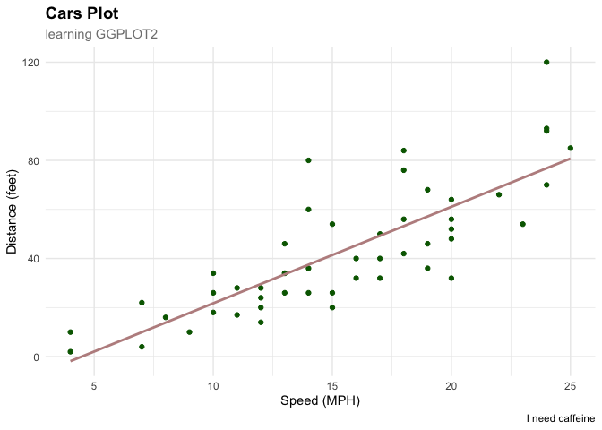
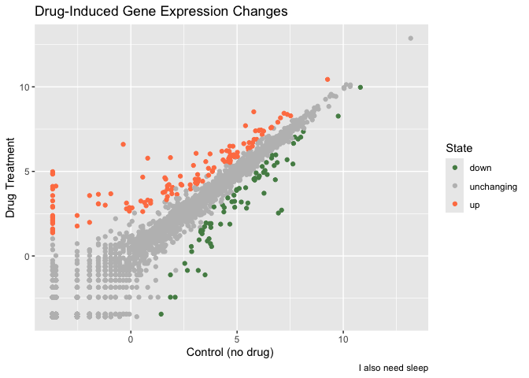
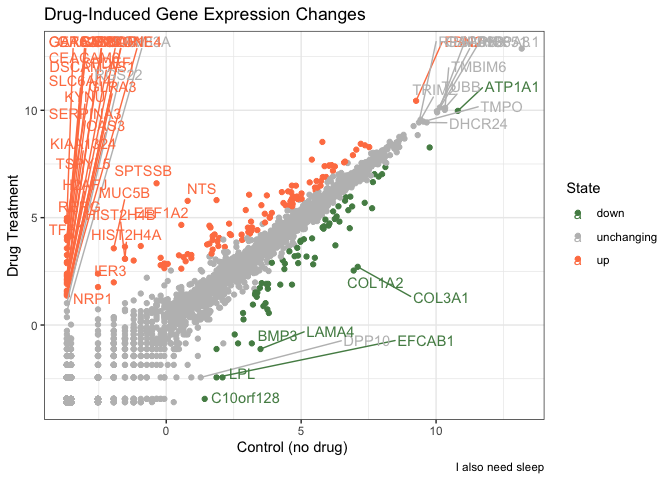

# Class 05: Data Visualization with GGPLOT
Brad Hunter (PID A69038089)

Today we are playing with plotting and graphics in R.

There are **lots** of ways to make cool figures in R. There is “base” R
graphics (`plot()`, `hist()`, `boxplot()` etc.)

There is also add-on packages, like **ggplot2**

Let’s play with the cars data set:

``` r
head(cars,10)
```

       speed dist
    1      4    2
    2      4   10
    3      7    4
    4      7   22
    5      8   16
    6      9   10
    7     10   18
    8     10   26
    9     10   34
    10    11   17

Let’s plot this with “base” R:

``` r
plot(cars)
```


Let’s plot mpg v. displacement

``` r
plot(mtcars$mpg, mtcars$disp)
```


``` r
hist(mtcars$mpg)
```


## Let’s use GGPLOT

The main function in the ggplot2 package is `ggplot()`. First I need to
install and load the **ggplot2** package. Installing using the
`install.packages()`

> **N.B.** I never want to run ‘install.packages()’ in my quarto source
> document!!

``` r
library(ggplot2)
```

    Warning: package 'ggplot2' was built under R version 4.5.2

``` r
ggplot(cars) +
  aes(speed, dist) +
  geom_point()
```


``` r
ggplot(cars) +
  aes(speed) +
  geom_histogram()
```

    `stat_bin()` using `bins = 30`. Pick better value `binwidth`.


Every ggplot needs at least 3 things:

- The **data** component
- The **(aes)thetic** mapping
- The **(geom)etry** (i.e `geom_point()`)

> For simple canned graphs “base” R is nearly always faster but it isn’t
> as customizable.

### Adding more layers

Let’s add a line, a title, subtitle and captions and custom axis names

``` r
ggplot(cars) +
  aes(speed, dist) +
  geom_point(color = "darkgreen") +
  geom_smooth(method = "lm", color = "rosybrown", se=FALSE) +
  labs(
    title    = "Cars Plot",
    subtitle = "learning GGPLOT2",
    x        = "Speed (MPH)",
    y        = "Distance (feet)",
    caption  = "I need caffeine"
  ) +
  theme_minimal() +
  theme(
    plot.title    = element_text(face = "bold", size = 14),
    plot.subtitle = element_text(size = 11, colour = "gray50")
  )
```

    `geom_smooth()` using formula = 'y ~ x'



## Plot some expression data

Reading data filr from online URL

``` r
url <- "https://bioboot.github.io/bimm143_S20/class-material/up_down_expression.txt"
genes <- read.delim(url)
head(genes)
```

            Gene Condition1 Condition2      State
    1      A4GNT -3.6808610 -3.4401355 unchanging
    2       AAAS  4.5479580  4.3864126 unchanging
    3      AASDH  3.7190695  3.4787276 unchanging
    4       AATF  5.0784720  5.0151916 unchanging
    5       AATK  0.4711421  0.5598642 unchanging
    6 AB015752.4 -3.6808610 -3.5921390 unchanging

> Q1. How many genes are in this dataset?

There are 5196 in this dataset.

> Q2. How many “up” regulated genes are there?

There are 127 Up genes, as seen in this table

``` r
table(genes$State)
```


          down unchanging         up 
            72       4997        127 

``` r
p <- ggplot(genes) +
  aes(x=Condition1, y=Condition2, col=State) +
  geom_point() +
  scale_colour_manual( values=c("palegreen4","gray","coral") ) +
  labs(title="Drug-Induced Gene Expression Changes",
         x="Control (no drug) ",
         y="Drug Treatment",
         caption="I also need sleep")
p
```



Adding rediculous labels

``` r
library(ggrepel)
ggplot(genes) +
  aes(x=Condition1, y=Condition2, col=State, label=Gene) +
  geom_point() +
  scale_colour_manual( values=c("palegreen4","gray","coral") ) +
  labs(title="Drug-Induced Gene Expression Changes",
         x="Control (no drug) ",
         y="Drug Treatment",
         caption="I also need sleep") +
  geom_text_repel(max.overlaps = 90) +
  theme_bw()
```

    Warning: ggrepel: 5144 unlabeled data points (too many overlaps). Consider
    increasing max.overlaps



## Going Further

``` r
url <- "https://raw.githubusercontent.com/jennybc/gapminder/master/inst/extdata/gapminder.tsv"

gapminder <- read.delim(url)
```

``` r
head(gapminder)
```

          country continent year lifeExp      pop gdpPercap
    1 Afghanistan      Asia 1952  28.801  8425333  779.4453
    2 Afghanistan      Asia 1957  30.332  9240934  820.8530
    3 Afghanistan      Asia 1962  31.997 10267083  853.1007
    4 Afghanistan      Asia 1967  34.020 11537966  836.1971
    5 Afghanistan      Asia 1972  36.088 13079460  739.9811
    6 Afghanistan      Asia 1977  38.438 14880372  786.1134

``` r
tail(gapminder)
```

          country continent year lifeExp      pop gdpPercap
    1699 Zimbabwe    Africa 1982  60.363  7636524  788.8550
    1700 Zimbabwe    Africa 1987  62.351  9216418  706.1573
    1701 Zimbabwe    Africa 1992  60.377 10704340  693.4208
    1702 Zimbabwe    Africa 1997  46.809 11404948  792.4500
    1703 Zimbabwe    Africa 2002  39.989 11926563  672.0386
    1704 Zimbabwe    Africa 2007  43.487 12311143  469.7093

``` r
library(dplyr)
```


    Attaching package: 'dplyr'

    The following objects are masked from 'package:stats':

        filter, lag

    The following objects are masked from 'package:base':

        intersect, setdiff, setequal, union

``` r
ggplot(gapminder) +
  aes(gdpPercap,lifeExp, col=continent, size=pop) +
  geom_point(alpha=0.5) +
  facet_wrap(~continent) +
  theme_bw()
```


\##ANAMATION!!!!!

``` r
library(gapminder)
```


    Attaching package: 'gapminder'

    The following object is masked _by_ '.GlobalEnv':

        gapminder

``` r
library(gganimate)

# Setup nice regular ggplot of the gapminder data
ggplot(gapminder, aes(gdpPercap, lifeExp, size = pop, colour = country)) +
  geom_point(alpha = 0.7, show.legend = FALSE) +
  scale_colour_manual(values = country_colors) +
  scale_size(range = c(2, 12)) +
  scale_x_log10() +
  # Facet by continent
  facet_wrap(~continent) +
  # Here comes the gganimate specific bits
  labs(title = 'Year: {frame_time}', x = 'GDP per capita', y = 'life expectancy') +
  transition_time(year) +
  shadow_wake(wake_length = 0.1, alpha = FALSE)
```


