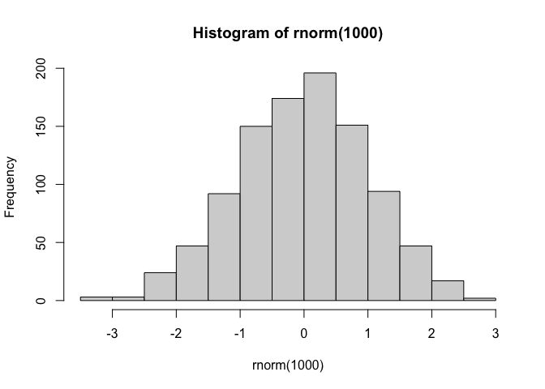
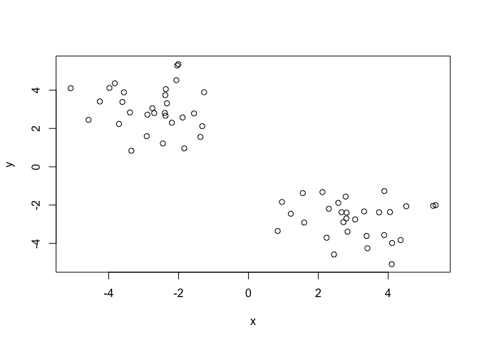
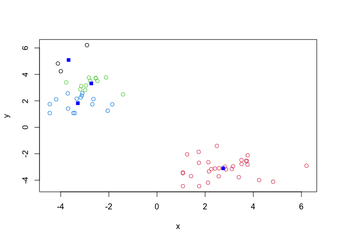
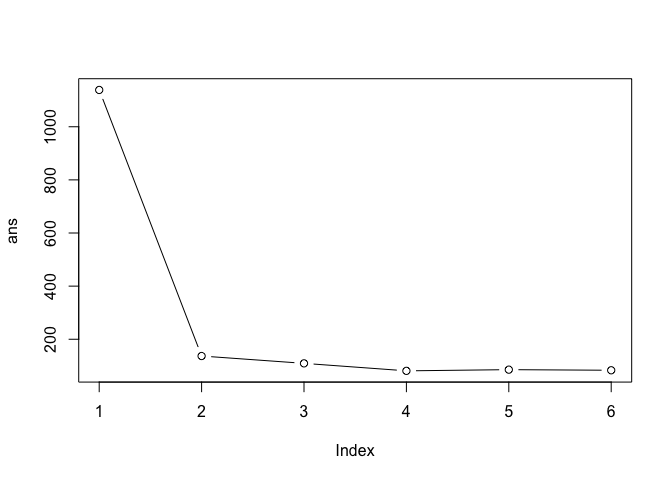
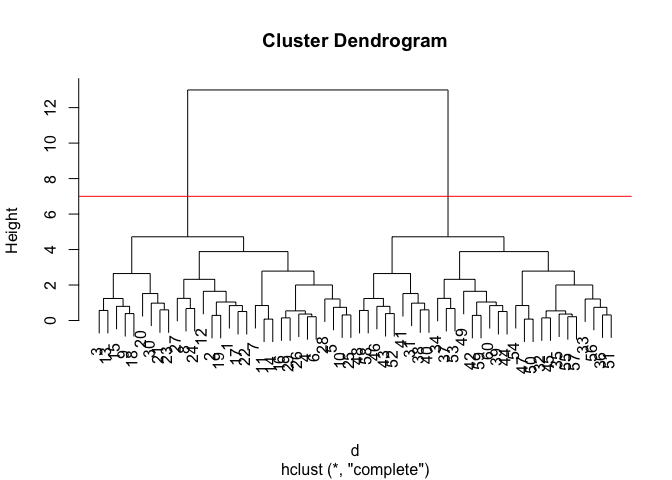
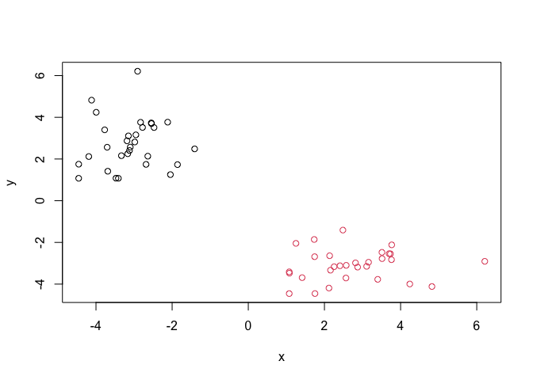

# Class 7: Machine Learning 1
Brad Hunter PID:A69038089

Today we will begin our exploration of some “classical” machine learing
approaches. We will start with clustering:

First we’ll make up some data to cluster with a known answer.

``` r
hist(rnorm(1000))
```



``` r
x <- c(rnorm(30, mean = -3), rnorm(30, mean = 3))
y <- rev(x)

z <- cbind(x,y)
```

Lets plot our data:

``` r
plot(z)
```



The main function in “base” R for K-means clustering is called
`kmeans()`.

``` r
k <- kmeans(z, centers=2)
k
```

    K-means clustering with 2 clusters of sizes 30, 30

    Cluster means:
              x         y
    1 -3.102612  2.747538
    2  2.747538 -3.102612

    Clustering vector:
     [1] 1 1 1 1 1 1 1 1 1 1 1 1 1 1 1 1 1 1 1 1 1 1 1 1 1 1 1 1 1 1 2 2 2 2 2 2 2 2
    [39] 2 2 2 2 2 2 2 2 2 2 2 2 2 2 2 2 2 2 2 2 2 2

    Within cluster sum of squares by cluster:
    [1] 57.68898 57.68898
     (between_SS / total_SS =  89.9 %)

    Available components:

    [1] "cluster"      "centers"      "totss"        "withinss"     "tot.withinss"
    [6] "betweenss"    "size"         "iter"         "ifault"      

> Q. How big are the clusters (i.e their size)?

``` r
k$size
```

    [1] 30 30

> Q. What clusters do my data points reside in?

``` r
k$cluster
```

     [1] 1 1 1 1 1 1 1 1 1 1 1 1 1 1 1 1 1 1 1 1 1 1 1 1 1 1 1 1 1 1 2 2 2 2 2 2 2 2
    [39] 2 2 2 2 2 2 2 2 2 2 2 2 2 2 2 2 2 2 2 2 2 2

> Q. Make a plot of our data colored by cluster assignment - i.e. Make a
> result figure…

``` r
plot(z, col = k$cluster)
points(k$centers, col ="blue", pch=15)
```


> Q. Cluster with k-means into 4 clusters and plot your results as above

``` r
k4 <- kmeans(z, centers=4)
plot(z, col = k4$cluster)
points(k4$centers, col ="blue", pch=15)
```



> Q. Run kmeans with centers (i.e. values of k) equal 1 to 6, using a
> for loop

``` r
ans <- NULL
for(i in 1:6){
  ans <- c(ans, kmeans(z, centers = i)$tot.withinss)
}
ans
```

    [1] 1142.10555  115.37797   88.18970   61.00143   60.49974   46.78611

Plot this “scree-plot”

``` r
plot(ans, typ="b")
```



## Hierarchical Clustering

The main function in “base” R for this is called `hclust()`.

``` r
d <- dist(z)
hc <- hclust(d)
hc
```


    Call:
    hclust(d = d)

    Cluster method   : complete 
    Distance         : euclidean 
    Number of objects: 60 

``` r
plot(hc)
abline(h=7, col="red")
```



To obtain clusters from our `hclust` object **hc** we “cut” the tree to
yield different sub branches. For this we use the `cutree()` function.

``` r
grps <- cutree(hc, h=7)
grps
```

     [1] 1 1 1 1 1 1 1 1 1 1 1 1 1 1 1 1 1 1 1 1 1 1 1 1 1 1 1 1 1 1 2 2 2 2 2 2 2 2
    [39] 2 2 2 2 2 2 2 2 2 2 2 2 2 2 2 2 2 2 2 2 2 2

Results Figure

``` r
plot(z, col=grps)
```



## PCA’s!!!!! (Principal Component Analysis)

``` r
url <- "https://tinyurl.com/UK-foods"
data <- read.csv(url, row.names = 1)
```

> Q1. How many rows and columns are in your new data frame named x? What
> R functions could you use to answer this questions?

``` r
dim(data)
```

    [1] 17  4

> Q2. Which approach to solving the ‘row-names problem’ mentioned above
> do you prefer and why? Is one approach more robust than another under
> certain circumstances?

I prefer the second method (read.csv(url, row.names=1)) so that my row
names are not lost with no danger to losing data (like calling x \<-
x\[,-1\] multiple times)

### Spotting major differences and trends

``` r
barplot(as.matrix(data), beside=T, col=rainbow(nrow(data)))
```


> Q3: Changing what optional argument in the above barplot() function
> results in the following plot?

Changing the besides arugment to false will result in the following plot

``` r
barplot(as.matrix(data), beside=F, col=rainbow(nrow(data)))
```


> Q5: Generating all pairwise plots may help somewhat. Can you make
> sense of the following code and resulting figure? What does it mean if
> a given point lies on the diagonal for a given plot?

If a given point lies on the diagonal, it is the same (or very similar)
for both datasets (countries) being compared.

``` r
pairs(data, col=rainbow(10), pch=16)
```


> Q6. What is the main differences between N. Ireland and the other
> countries of the UK in terms of this data-set?

It’s hard to tell, it seems like N. Ireland consumes more dark blue food
group. Wales and England look very similar.

## PCA to the rescue

The main function in “base” R for PCA is called `prcomp()`.

But first we must transpose our dataset so the foods (dependent var) are
in the columns and the countries (independent var) are in the rows using
the `t()` function.

``` r
pca <- prcomp(t(data))
summary(pca)
```

    Importance of components:
                                PC1      PC2      PC3       PC4
    Standard deviation     324.1502 212.7478 73.87622 2.921e-14
    Proportion of Variance   0.6744   0.2905  0.03503 0.000e+00
    Cumulative Proportion    0.6744   0.9650  1.00000 1.000e+00

Our result object is called `pca` and it has a `$x` componenent that we
will look at first

``` r
pca$x
```

                     PC1         PC2        PC3           PC4
    England   -144.99315   -2.532999 105.768945 -9.152022e-15
    Wales     -240.52915 -224.646925 -56.475555  5.560040e-13
    Scotland   -91.86934  286.081786 -44.415495 -6.638419e-13
    N.Ireland  477.39164  -58.901862  -4.877895  1.329771e-13

Making a ordination plot

``` r
library(ggplot2)
```

    Warning: package 'ggplot2' was built under R version 4.5.2

``` r
ggplot(pca$x,aes(PC1,PC2, label=rownames(pca$x))) +
  geom_point() +
  geom_text()
```


Another major result out of PCA is the so-called “variable loadings” or
`$rotation` that tells us how the origional variables (foods) contribute
to PCs (i.e. our new axis).

``` r
ggplot(pca$rotation) +
  aes(PC1, rownames(pca$rotation)) +
  geom_col()
```


> Q7. Complete the code below to generate a plot of PC1 vs PC2. The
> second line adds text labels over the data points.

``` r
# Create a data frame for plotting
df <- as.data.frame(pca$x)
df$Country <- rownames(df)

# Plot PC1 vs PC2 with ggplot
ggplot(pca$x) +
  aes(x = PC1, y = PC2, label = rownames(pca$x)) +
  geom_point(size = 3) +
  geom_text(vjust = -0.5) +
  xlim(-270, 500) +
  xlab("PC1") +
  ylab("PC2") +
  theme_bw()
```


