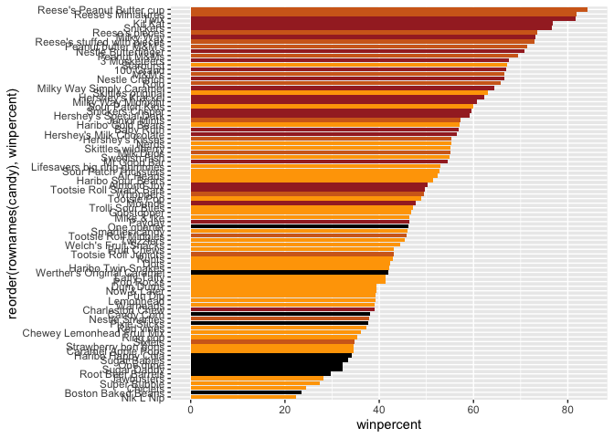
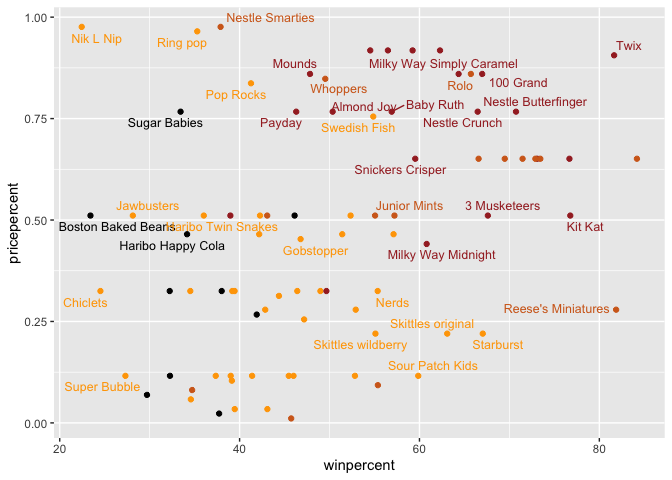
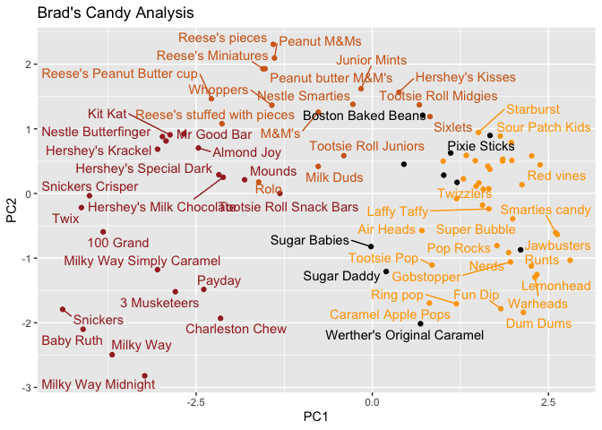

# Lab_10_Halloween_Project
Brad Hunter (PID: A69038089)

## Happy Halloween!!!

Let’s load libraries up top for sanity.

``` r
library(dplyr)
library(ggplot2)
```

    Warning: package 'ggplot2' was built under R version 4.5.2

``` r
library("skimr")
library(ggrepel)
library(corrplot)
```

Let’s load and look at our data.

``` r
candy_file <- "candy-data.csv"

candy = read.csv(candy_file, row.names = 1)
flextable::flextable(head(candy))
```


> Q1. How many different candy types are in this dataset?

There are 12 different candy types (categories) and 85 different types
of candy.

> Q2. How many fruity candy types are in the dataset?

There are 38 fruity candy types.

## What is your favorite candy?

> Q3. What is your favorite candy in the dataset and what is it’s
> winpercent value?

My favorite candy is Almond Joy and it’s win percentage is 50.35%.

``` r
candy["Almond Joy",]$winpercent
```

    [1] 50.34755

> Q4. What is the winpercent value for “Kit Kat”?

Kit Kat’s win percentage is 76.77%.

> Q5. What is the winpercent value for “Tootsie Roll Snack Bars”?

The win percentage for Tootsie Roll Snack Bars is 49.65%.

Let’s look at our data using skimr

``` r
skim(candy)
```

|                                                  |       |
|:-------------------------------------------------|:------|
| Name                                             | candy |
| Number of rows                                   | 85    |
| Number of columns                                | 12    |
| \_\_\_\_\_\_\_\_\_\_\_\_\_\_\_\_\_\_\_\_\_\_\_   |       |
| Column type frequency:                           |       |
| numeric                                          | 12    |
| \_\_\_\_\_\_\_\_\_\_\_\_\_\_\_\_\_\_\_\_\_\_\_\_ |       |
| Group variables                                  | None  |

Data summary

**Variable type: numeric**

| skim_variable | n_missing | complete_rate | mean | sd | p0 | p25 | p50 | p75 | p100 | hist |
|:---|---:|---:|---:|---:|---:|---:|---:|---:|---:|:---|
| chocolate | 0 | 1 | 0.44 | 0.50 | 0.00 | 0.00 | 0.00 | 1.00 | 1.00 | ▇▁▁▁▆ |
| fruity | 0 | 1 | 0.45 | 0.50 | 0.00 | 0.00 | 0.00 | 1.00 | 1.00 | ▇▁▁▁▆ |
| caramel | 0 | 1 | 0.16 | 0.37 | 0.00 | 0.00 | 0.00 | 0.00 | 1.00 | ▇▁▁▁▂ |
| peanutyalmondy | 0 | 1 | 0.16 | 0.37 | 0.00 | 0.00 | 0.00 | 0.00 | 1.00 | ▇▁▁▁▂ |
| nougat | 0 | 1 | 0.08 | 0.28 | 0.00 | 0.00 | 0.00 | 0.00 | 1.00 | ▇▁▁▁▁ |
| crispedricewafer | 0 | 1 | 0.08 | 0.28 | 0.00 | 0.00 | 0.00 | 0.00 | 1.00 | ▇▁▁▁▁ |
| hard | 0 | 1 | 0.18 | 0.38 | 0.00 | 0.00 | 0.00 | 0.00 | 1.00 | ▇▁▁▁▂ |
| bar | 0 | 1 | 0.25 | 0.43 | 0.00 | 0.00 | 0.00 | 0.00 | 1.00 | ▇▁▁▁▂ |
| pluribus | 0 | 1 | 0.52 | 0.50 | 0.00 | 0.00 | 1.00 | 1.00 | 1.00 | ▇▁▁▁▇ |
| sugarpercent | 0 | 1 | 0.48 | 0.28 | 0.01 | 0.22 | 0.47 | 0.73 | 0.99 | ▇▇▇▇▆ |
| pricepercent | 0 | 1 | 0.47 | 0.29 | 0.01 | 0.26 | 0.47 | 0.65 | 0.98 | ▇▇▇▇▆ |
| winpercent | 0 | 1 | 50.32 | 14.71 | 22.45 | 39.14 | 47.83 | 59.86 | 84.18 | ▃▇▆▅▂ |

> Q6. Is there any variable/column that looks to be on a different scale
> to the majority of the other columns in the dataset?

Yes, winpercent looks to be on a 100x scale than the other columns.

> Q7. What do you think a zero and one represent for the
> candy\$chocolate column?

A zero represents a candy without any chocolate, and a 1 represents a
candy with chocolate.

> Q8. Plot a histogram of winpercent values

``` r
ggplot(candy) +
  aes(winpercent) +
  geom_histogram(bins = 20)
```


> Q9. Is the distribution of winpercent values symmetrical?

``` r
ggplot(candy) +
  aes(winpercent) +
  geom_density()
```


No, it does not look symmetrical.

> Q10. Is the center of the distribution above or below 50%?

``` r
summary(candy$winpercent)
```

       Min. 1st Qu.  Median    Mean 3rd Qu.    Max. 
      22.45   39.14   47.83   50.32   59.86   84.18 

Below 50%.

> Q11. On average is chocolate candy higher or lower ranked than fruit
> candy?

``` r
choc.win.ave <- candy |> filter(chocolate==1) |> pull(winpercent) |> mean()
fruit.win.ave <- candy |> filter(fruity==1) |> pull(winpercent) |> mean()
```

Yes, the chocolate win mean is 60.9215294 and the fruity win mean is
44.1197414.

> Q12. Is this difference statistically significant?

``` r
t.test((candy |> filter(chocolate==1) |> pull(winpercent)), candy |> filter(fruity==1) |> pull(winpercent))
```


        Welch Two Sample t-test

    data:  (pull(filter(candy, chocolate == 1), winpercent)) and pull(filter(candy, fruity == 1), winpercent)
    t = 6.2582, df = 68.882, p-value = 2.871e-08
    alternative hypothesis: true difference in means is not equal to 0
    95 percent confidence interval:
     11.44563 22.15795
    sample estimates:
    mean of x mean of y 
     60.92153  44.11974 

Yes, the difference is significantly different.

> Q13. What are the five least liked candy types in this set?

``` r
candy |> arrange(winpercent) |> head(5) |> rownames()
```

    [1] "Nik L Nip"          "Boston Baked Beans" "Chiclets"          
    [4] "Super Bubble"       "Jawbusters"        

> Q14. What are the top 5 all time favorite candy types out of this set?

``` r
candy |> arrange(winpercent) |> tail(5) |> rownames()
```

    [1] "Snickers"                  "Kit Kat"                  
    [3] "Twix"                      "Reese's Miniatures"       
    [5] "Reese's Peanut Butter cup"

> Q15. Make a first barplot of candy ranking based on winpercent values.

``` r
ggplot(candy) + 
  aes(winpercent, rownames(candy)) +
  geom_col()
```


> Q16. This is quite ugly, use the reorder() function to get the bars
> sorted by winpercent?

``` r
ggplot(candy) + 
  aes(winpercent, reorder(rownames(candy),winpercent)) +
  geom_col()
```


Let’s add some color to the graph!

``` r
my_cols=rep("black", nrow(candy))
my_cols[as.logical(candy$chocolate)] = "chocolate"
my_cols[as.logical(candy$bar)] = "brown"
my_cols[as.logical(candy$fruity)] = "orange"

ggplot(candy) + 
  aes(winpercent, reorder(rownames(candy),winpercent)) +
  geom_col(fill=my_cols) 
```



> Q17. What is the worst ranked chocolate candy?

The worst ranked choclolate is Sixlets.

> Q18. What is the best ranked fruity candy?

The best ranked fruity candy is Starburst.

## Taking a look at pricepercent

``` r
ggplot(candy) +
  aes(winpercent, pricepercent, label=rownames(candy)) +
  geom_point(col=my_cols) + 
  geom_text_repel(col=my_cols, size=3.3, max.overlaps = 5)
```



> Q19. Which candy type is the highest ranked in terms of winpercent for
> the least money - i.e. offers the most bang for your buck?

Reese’s Miniatures

> Q20. What are the top 5 most expensive candy types in the dataset and
> of these which is the least popular?

``` r
candy |> arrange(pricepercent) |> tail(5) |> arrange(winpercent) |> rownames()
```

    [1] "Nik L Nip"              "Ring pop"               "Nestle Smarties"       
    [4] "Mr Good Bar"            "Hershey's Special Dark"

And of those, Nik L Nip is the least popular.

## Correlation

``` r
cij <- cor(candy)
corrplot(cij)
```


> Q22. Examining this plot what two variables are anti-correlated
> (i.e. have minus values)?

Fruity and chocolate are anti-correlated.

> Q23. Similarly, what two variables are most positively correlated?

Chocolate and winpercent are most correlated, followed closely by
chocolate and bar.

## Principal Component Analysis

The main function in base R for this is `prcomp()` and we want to set
`scale=TRUE` here:

``` r
pca <- prcomp(candy, scale=TRUE)
summary(pca)
```

    Importance of components:
                              PC1    PC2    PC3     PC4    PC5     PC6     PC7
    Standard deviation     2.0788 1.1378 1.1092 1.07533 0.9518 0.81923 0.81530
    Proportion of Variance 0.3601 0.1079 0.1025 0.09636 0.0755 0.05593 0.05539
    Cumulative Proportion  0.3601 0.4680 0.5705 0.66688 0.7424 0.79830 0.85369
                               PC8     PC9    PC10    PC11    PC12
    Standard deviation     0.74530 0.67824 0.62349 0.43974 0.39760
    Proportion of Variance 0.04629 0.03833 0.03239 0.01611 0.01317
    Cumulative Proportion  0.89998 0.93832 0.97071 0.98683 1.00000

Let’s plot our main PCA scores

``` r
ggplot(pca$x) +
  aes(PC1,PC2, label=rownames(pca$x)) +
  geom_point(col = my_cols) +
  geom_text_repel(col=my_cols) +
  labs(title="Brad's Candy Analysis")
```

    Warning: ggrepel: 24 unlabeled data points (too many overlaps). Consider
    increasing max.overlaps



Don’t forget about your variable “loadings” - how the origional
variables contribute to your new PCs…

``` r
ggplot(pca$rotation) +
  aes(PC1,rownames(pca$rotation)) +
  geom_col()
```


> Q24. What original variables are picked up strongly by PC1 in the
> positive direction? Do these make sense to you?

Chocolate, bar, winpercent, pricepercent are all strongly positive in
PC1 and yes this makes sense, all of these variables are associated with
each other.
