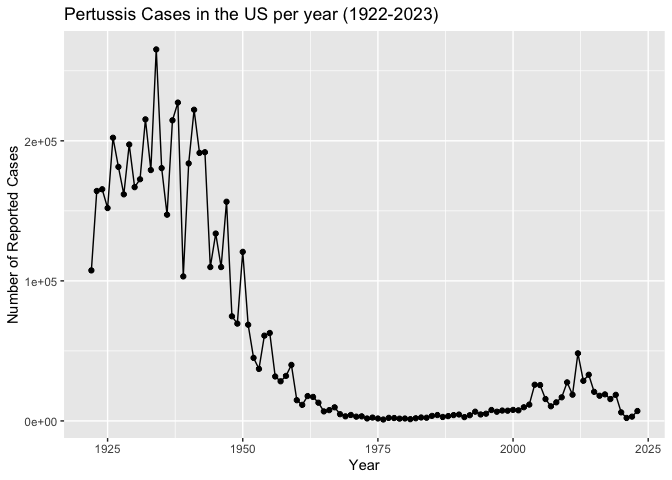
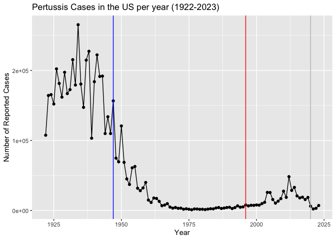
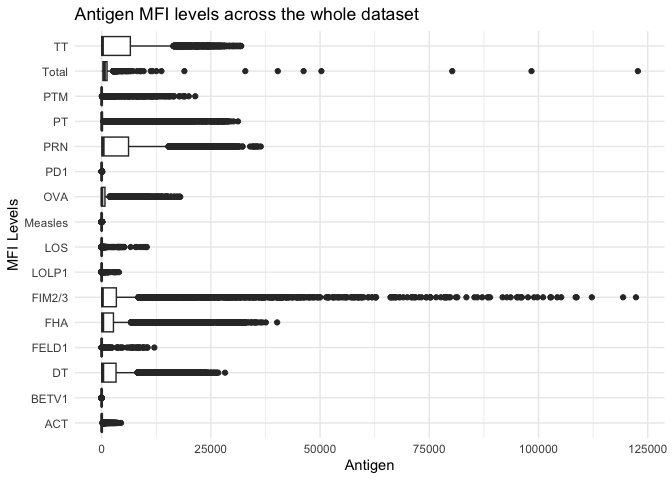
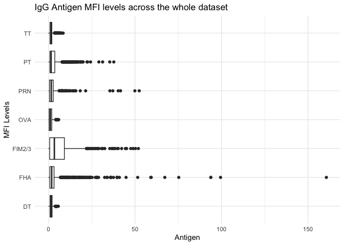
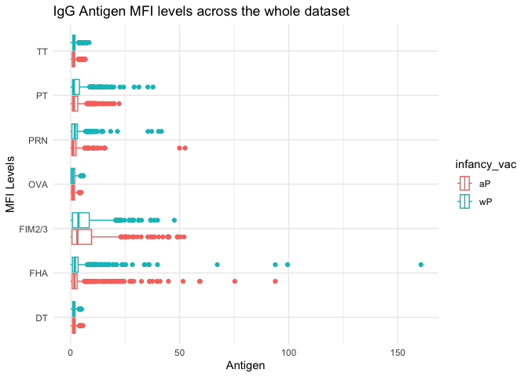
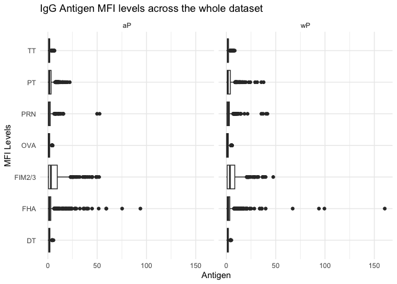
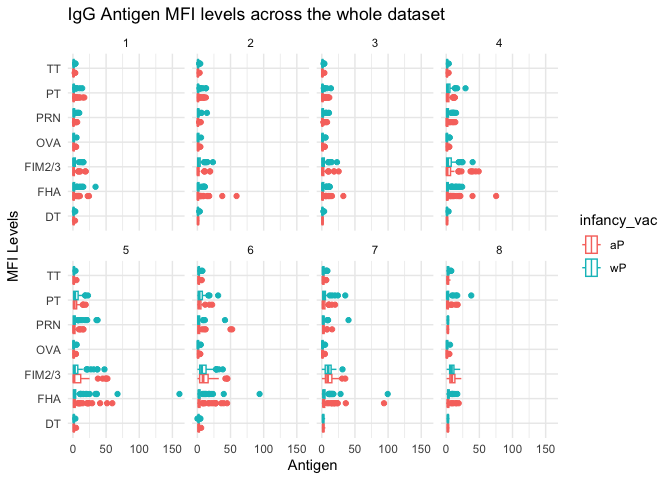

# pertussis_miniproject
Brad Hunter (PID A69038089)

- [Background](#background)
- [The CMI-PB project](#the-cmi-pb-project)
- [Focus in IgG](#focus-in-igg)
  - [Differneces between aP and wP?](#differneces-between-ap-and-wp)
  - [Time course analysis](#time-course-analysis)
- [Time course of PT (Virulence Factor: Pertussis
  Toxin)](#time-course-of-pt-virulence-factor-pertussis-toxin)
- [System Setup](#system-setup)

## Background

Pertussis (a.k.a Whoooping cough) is a highly infectious lung infection
caused by the bacteria *B. Pertussis*.

The CDC tracks case numbers in the US and makes this data available
online:

``` r
library(ggplot2)
library(jsonlite)
library(dplyr)
```

> Q1. Make a plot of Pertussis cases per year with ggplot

``` r
ggplot(cdc) +
  aes(year, cases) +
  geom_point() +
  geom_line() +
  labs(
    title = "Pertussis Cases in the US per year (1922-2023)",
    x = "Year",
    y = "Number of Reported Cases"
  )
```



> Q2. Add some annotation (lines on the plot) for some major milestones
> in our interaction with Pertussis. The original wP vaccine was
> introduced in 1947 and the newer aP vaccine was introduced in 1996,
> and the COVID-19 pandemic began in 2020.

``` r
ggplot(cdc) +
  aes(year, cases) +
  geom_point() +
  geom_line() +
  labs(
    title = "Pertussis Cases in the US per year (1922-2023)",
    x = "Year",
    y = "Number of Reported Cases"
  ) +
  geom_vline(xintercept = 1947, col="blue") +
  geom_vline(xintercept = 1996, col="red") +
  geom_vline(xintercept = 2020, col="grey") 
```



> Q3. Describe what happened after the introduction of the aP vaccine?
> Do you have a possible explanation for the observed trend?

There is an increase in cases 10 years after the aP vaccine was
introduced, which may be due to waning immunity from that particular
vaccine. Basically, the wP vaccince was more effective than the aP
despite severe side effects.

## The CMI-PB project

The CMI-Pertussis Boost (PB) project focuses on gathering data on this
very topic. What is distinct between the aP and wP individuals over time
when they encounter Pertussis again.

They make their data available via a JSON format returning API. We can
read JSON formate with the `read_json()` function from the **jsonlite**
package.

``` r
subject <- read_json("http://cmi-pb.org/api/v5_1/subject", simplifyVector = TRUE)

head(subject)
```

      subject_id infancy_vac biological_sex              ethnicity  race
    1          1          wP         Female Not Hispanic or Latino White
    2          2          wP         Female Not Hispanic or Latino White
    3          3          wP         Female                Unknown White
    4          4          wP           Male Not Hispanic or Latino Asian
    5          5          wP           Male Not Hispanic or Latino Asian
    6          6          wP         Female Not Hispanic or Latino White
      year_of_birth date_of_boost      dataset
    1    1986-01-01    2016-09-12 2020_dataset
    2    1968-01-01    2019-01-28 2020_dataset
    3    1983-01-01    2016-10-10 2020_dataset
    4    1988-01-01    2016-08-29 2020_dataset
    5    1991-01-01    2016-08-29 2020_dataset
    6    1988-01-01    2016-10-10 2020_dataset

> Q4. How many “subjects” (or individuals) are in this dataset?

There are 172 subjects in this dataset.

> Q5. How many wP and aP primmed subjects are there in the dataset?

``` r
table(subject$infancy_vac)
```


    aP wP 
    87 85 

> Q6. What is the `biological_sex` and `race` breakdown of the subjects
> in the dataset?

``` r
table(subject$race, subject$biological_sex)
```

                                               
                                                Female Male
      American Indian/Alaska Native                  0    1
      Asian                                         32   12
      Black or African American                      2    3
      More Than One Race                            15    4
      Native Hawaiian or Other Pacific Islander      1    1
      Unknown or Not Reported                       14    7
      White                                         48   32

Let’s read more tables from teh CMI-PB database API

``` r
specimen <- read_json("http://cmi-pb.org/api/v5_1/specimen", simplifyVector = TRUE)
ab_titer <- read_json("http://cmi-pb.org/api/v5_1/plasma_ab_titer", simplifyVector = TRUE)
```

Join using the `inner_join()` function from the **dplyr** package.

``` r
meta <- inner_join(subject, specimen)
```

    Joining with `by = join_by(subject_id)`

``` r
head(meta)
```

      subject_id infancy_vac biological_sex              ethnicity  race
    1          1          wP         Female Not Hispanic or Latino White
    2          1          wP         Female Not Hispanic or Latino White
    3          1          wP         Female Not Hispanic or Latino White
    4          1          wP         Female Not Hispanic or Latino White
    5          1          wP         Female Not Hispanic or Latino White
    6          1          wP         Female Not Hispanic or Latino White
      year_of_birth date_of_boost      dataset specimen_id
    1    1986-01-01    2016-09-12 2020_dataset           1
    2    1986-01-01    2016-09-12 2020_dataset           2
    3    1986-01-01    2016-09-12 2020_dataset           3
    4    1986-01-01    2016-09-12 2020_dataset           4
    5    1986-01-01    2016-09-12 2020_dataset           5
    6    1986-01-01    2016-09-12 2020_dataset           6
      actual_day_relative_to_boost planned_day_relative_to_boost specimen_type
    1                           -3                             0         Blood
    2                            1                             1         Blood
    3                            3                             3         Blood
    4                            7                             7         Blood
    5                           11                            14         Blood
    6                           32                            30         Blood
      visit
    1     1
    2     2
    3     3
    4     4
    5     5
    6     6

``` r
ab_data <- inner_join(meta, ab_titer)
```

    Joining with `by = join_by(specimen_id)`

``` r
head(ab_data)
```

      subject_id infancy_vac biological_sex              ethnicity  race
    1          1          wP         Female Not Hispanic or Latino White
    2          1          wP         Female Not Hispanic or Latino White
    3          1          wP         Female Not Hispanic or Latino White
    4          1          wP         Female Not Hispanic or Latino White
    5          1          wP         Female Not Hispanic or Latino White
    6          1          wP         Female Not Hispanic or Latino White
      year_of_birth date_of_boost      dataset specimen_id
    1    1986-01-01    2016-09-12 2020_dataset           1
    2    1986-01-01    2016-09-12 2020_dataset           1
    3    1986-01-01    2016-09-12 2020_dataset           1
    4    1986-01-01    2016-09-12 2020_dataset           1
    5    1986-01-01    2016-09-12 2020_dataset           1
    6    1986-01-01    2016-09-12 2020_dataset           1
      actual_day_relative_to_boost planned_day_relative_to_boost specimen_type
    1                           -3                             0         Blood
    2                           -3                             0         Blood
    3                           -3                             0         Blood
    4                           -3                             0         Blood
    5                           -3                             0         Blood
    6                           -3                             0         Blood
      visit isotype is_antigen_specific antigen        MFI MFI_normalised  unit
    1     1     IgE               FALSE   Total 1110.21154       2.493425 UG/ML
    2     1     IgE               FALSE   Total 2708.91616       2.493425 IU/ML
    3     1     IgG                TRUE      PT   68.56614       3.736992 IU/ML
    4     1     IgG                TRUE     PRN  332.12718       2.602350 IU/ML
    5     1     IgG                TRUE     FHA 1887.12263      34.050956 IU/ML
    6     1     IgE                TRUE     ACT    0.10000       1.000000 IU/ML
      lower_limit_of_detection
    1                 2.096133
    2                29.170000
    3                 0.530000
    4                 6.205949
    5                 4.679535
    6                 2.816431

> Q7. How many different Ab isotypes are there?

``` r
unique(ab_data$isotype)
```

    [1] "IgE"  "IgG"  "IgG1" "IgG2" "IgG3" "IgG4"

> Q8. How many differnt Antigens are there in the dataset?

``` r
unique(ab_data$antigen)
```

     [1] "Total"   "PT"      "PRN"     "FHA"     "ACT"     "LOS"     "FELD1"  
     [8] "BETV1"   "LOLP1"   "Measles" "PTM"     "FIM2/3"  "TT"      "DT"     
    [15] "OVA"     "PD1"    

> Q9. Let’s plot antigen MFI levels across the whole dataset

``` r
ggplot(ab_data) +
  aes(MFI, antigen) +
  geom_boxplot() +
  labs(
    title = "Antigen MFI levels across the whole dataset",
    x = "Antigen",
    y = "MFI Levels"
  ) +
  theme_minimal()
```

    Warning: Removed 1 row containing non-finite outside the scale range
    (`stat_boxplot()`).



## Focus in IgG

IgG is crucial for long-term immunity and responding to bacterial &
viral infections.

``` r
ab_data |> filter(isotype == "IgG") -> igg
```

Plot of antigen levels again but only IgG

``` r
ggplot(igg) +
  aes(MFI_normalised, antigen) +
  geom_boxplot() +
  labs(
    title = "IgG Antigen MFI levels across the whole dataset",
    x = "Antigen",
    y = "MFI Levels"
  ) +
  theme_minimal()
```



### Differneces between aP and wP?

We can color up by the `infancy_vac` values of “wP” or “aP”

``` r
ggplot(igg) +
  aes(MFI_normalised, antigen, col=infancy_vac) +
  geom_boxplot() +
  labs(
    title = "IgG Antigen MFI levels across the whole dataset",
    x = "Antigen",
    y = "MFI Levels"
  ) +
  theme_minimal()
```



We could “facet” by the “aP” vs “wP” column

``` r
ggplot(igg) +
  aes(MFI_normalised, antigen) +
  geom_boxplot() +
  labs(
    title = "IgG Antigen MFI levels across the whole dataset",
    x = "Antigen",
    y = "MFI Levels"
  ) +
  theme_minimal() +
  facet_wrap(~infancy_vac)
```



### Time course analysis

We can use `visit` as a proxy for the time here and facet our plots by
this value 1 to 8…

``` r
igg |> filter(visit %in% 1:8) |>
 ggplot() +
  aes(MFI_normalised, antigen, col=infancy_vac) +
  geom_boxplot() +
  labs(
    title = "IgG Antigen MFI levels across the whole dataset",
    x = "Antigen",
    y = "MFI Levels"
  ) +
  theme_minimal() +
  facet_wrap(~visit, nrow=2)
```



## Time course of PT (Virulence Factor: Pertussis Toxin)

``` r
igg |> filter(antigen == "PT") |> filter(dataset == "2021_dataset") -> pt
```

``` r
ggplot(pt) +
  aes(planned_day_relative_to_boost, MFI_normalised, col=infancy_vac, group = subject_id) +
  geom_point() +
  geom_line() +
  geom_vline(xintercept = 14, col="darkgreen")
```


## System Setup

``` r
sessionInfo()
```

    R version 4.5.1 (2025-06-13)
    Platform: aarch64-apple-darwin20
    Running under: macOS Sequoia 15.7.2

    Matrix products: default
    BLAS:   /Library/Frameworks/R.framework/Versions/4.5-arm64/Resources/lib/libRblas.0.dylib 
    LAPACK: /Library/Frameworks/R.framework/Versions/4.5-arm64/Resources/lib/libRlapack.dylib;  LAPACK version 3.12.1

    locale:
    [1] en_US.UTF-8/en_US.UTF-8/en_US.UTF-8/C/en_US.UTF-8/en_US.UTF-8

    time zone: America/Los_Angeles
    tzcode source: internal

    attached base packages:
    [1] stats     graphics  grDevices utils     datasets  methods   base     

    other attached packages:
    [1] dplyr_1.1.4    jsonlite_2.0.0 ggplot2_4.0.1 

    loaded via a namespace (and not attached):
     [1] vctrs_0.6.5        cli_3.6.5          knitr_1.50         rlang_1.1.6       
     [5] xfun_0.54          generics_0.1.4     S7_0.2.1           labeling_0.4.3    
     [9] glue_1.8.0         htmltools_0.5.8.1  scales_1.4.0       rmarkdown_2.30    
    [13] grid_4.5.1         evaluate_1.0.5     tibble_3.3.0       fastmap_1.2.0     
    [17] yaml_2.3.10        lifecycle_1.0.4    compiler_4.5.1     RColorBrewer_1.1-3
    [21] pkgconfig_2.0.3    rstudioapi_0.17.1  farver_2.1.2       digest_0.6.38     
    [25] R6_2.6.1           tidyselect_1.2.1   pillar_1.11.1      magrittr_2.0.4    
    [29] withr_3.0.2        tools_4.5.1        gtable_0.3.6      
